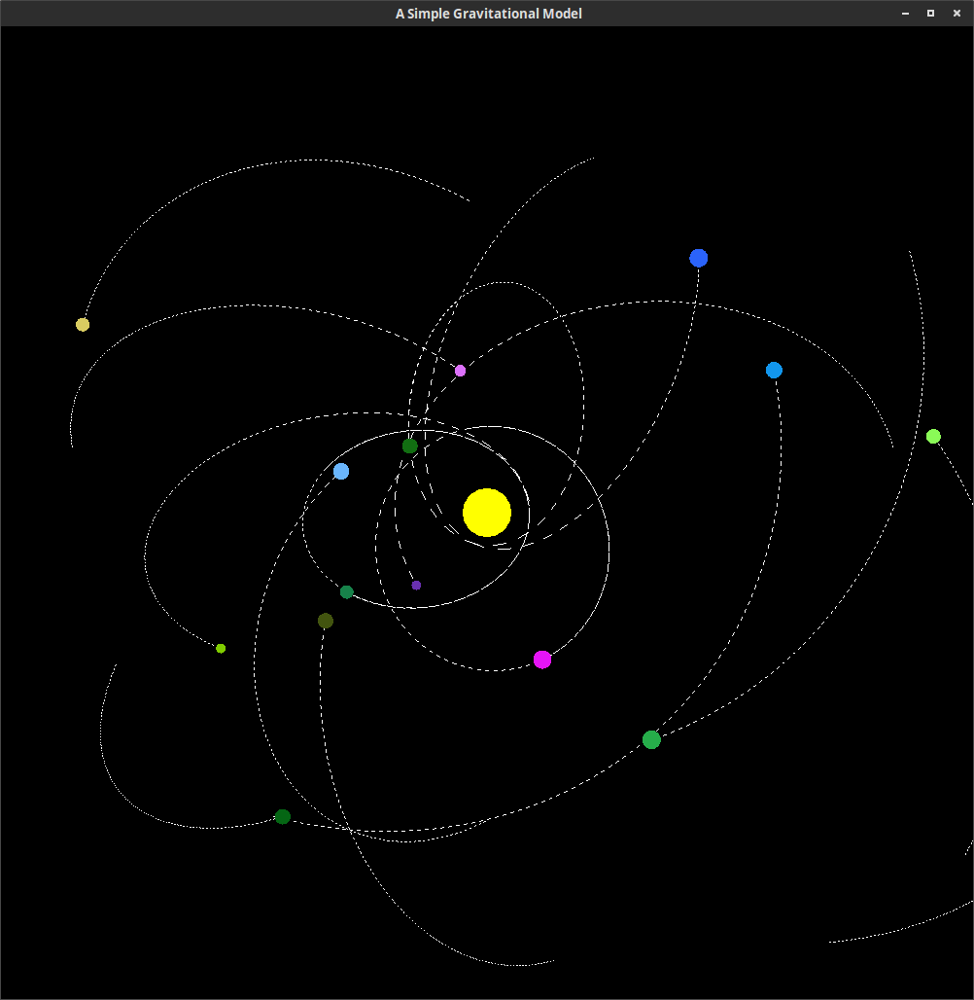

#Simple Gravitational Model
Simple Gravitational Model is an interactive simulation of orbital dynamics built using C++ and OpenGL. 

Using [Leapfrog Verlet Integration](https://en.wikipedia.org/wiki/Leapfrog_integration) we are able to model the effects of gravitational force of various small bodies orbiting a much more massive one. However, this algorithm is O(n^2) so performance will deteriorate rather quickly at around 100 bodies.

## Getting Started
Included are two binaries for the C++ and Haskell versions, gravcpp and gravHS respectively. Currently, these will only work in Linux.

## Instructions
**C++ Version Only:**

Left Click  - Place orbital body, drag and release to control initial velocity.

Right Click - Place solar body

Shift + X   - Show trails

X           - Clear trails

**Both Versions:**

S           - Create 50 random planets with random initial velocities

Shift + S   - Create 20 random solar bodies

## License

This project is licensed under the MIT License - see the [LICENSE.md](LICENSE.md) file for details
